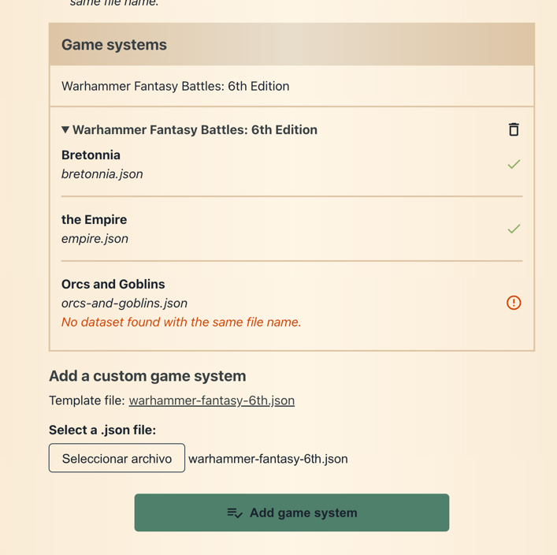
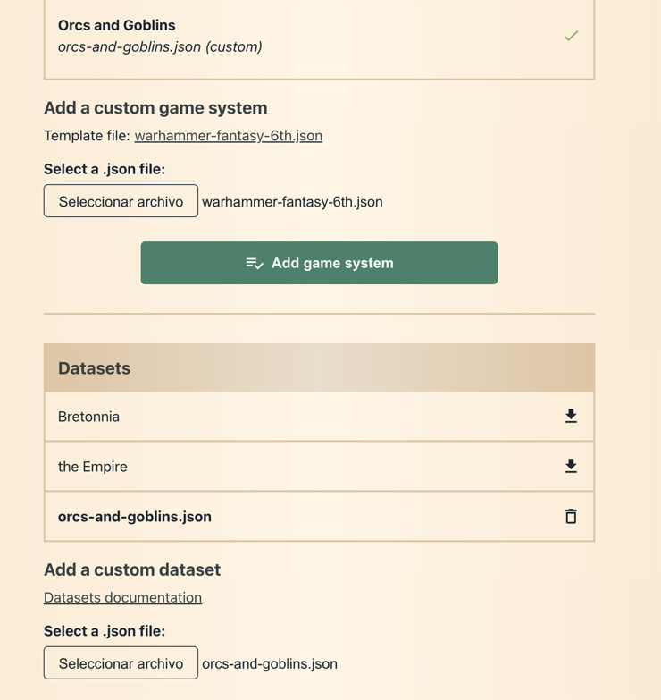

# Dataset format

The dataset for each army is defined in a [JSON](https://developer.mozilla.org/en-US/docs/Learn/JavaScript/Objects/JSON) format.

Datasets can be downloaded on the [Custom datasets](https://old-world-builder.com/custom-datasets) page.

You can also use our [Datasets editor](https://old-world-builder.com/datasets), no coding required.

> !! Attention: The Datasets Editor has not been updated for some time and no longer reflects the current format of the datasets.

## Army structure

### Warhammer: Warhammer Fantasy 6th edition and derivatives

```javascript
{
  "characters": [], 
  "lords": [],
  "heroes": [],
  "core": [],
  "special": [],
  "rare": [],
  "mercenaries": [],
  "allies": [],
}
```

## All unit options

```javascript
{
  "id": String, // Unique ID, example: "orc-warboss"
  "name_en": String, // English name
  "name_es": String, // Spanish name
  "named": Boolean, // Used for composition rules validation
  "points": Number, // Points for each model
  "minimum": Number, // Minimum number of models of the unit
  "maximum": Number, // Maximum number of models of the unit
  "magicItemsArmy": String, // Category the unit can take magic items from, optional
  "maxSignatureSpells": Number, // Number of maximum signature spells
  "army": String, // Only in mercanaries category, army ID, optional
  "armyComposition": { // Army composition specific options, optional
    [army composition ID]: { // Example: "troll-horde"
      "category": "characters" | "core" | "special" | "rare", // Category where the unit can be added
      "notes": { // Optional
        "name_en": String,
        "name_es": String
      },
      "specialRules" { // The english name is used for the rules popup window, optional
        "name_en": String,
        "name_es": String
      }
    }
  },
  "command": [ // A list of all command options, optional
    {
      "name_en": String,
      "name_es": String,
      "points": Number,
      "alwaysActive": Boolean, // Always selected and cannot be deselected, optional
      "magic": {
        "types": [String], // Limit the available magic items (see "magic-items.json" types)
        "maxPoints": Number, // Maximum points for magic items
        "notes": { // Optional
          "name_en": String,
          "name_es": String
        }
      }
    }
  ],
  "equipment": [ // All weapon options, they are mutually exclusive
    {
      "name_en": String,
      "name_es": String,
      "points": Number,
      "perModel": Boolean, // Wether the points are counted per model, optional
      "active": Boolean, // Wether it should be selected by default, optional
      "equippedDefault": Boolean, // Weather it should always show up, even if deselected (e.g. for Hand weapons), optional
      "armyComposition": [army composition IDs], // Only available for those army compositions, optional
      "notes": { // Optional
        "name_en": String,
        "name_es": String
      }
    }
  ],
  "armor": [ // All armor options, they are mutually exclusive
    {
      "name_en": String,
      "name_es": String,
      "points": Number,
      "perModel": Boolean, // Optional
      "active": Boolean, // Optional
      "equippedDefault": Boolean, // Optional
      "armyComposition": [army composition IDs], // Optional
      "notes": { // Optional
        "name_en": String,
        "name_es": String,
      }
    }
  ],
  "options": [ // All options, they are NOT mutually exclusive
    {
      "name_en": String,
      "name_es": String,
      "points": Number,
      "perModel": Boolean, // Optional
      "active": Boolean, // Optional
      "alwaysActive": Boolean, // Always selected and cannot be deselected, optional
      "stackable": Boolean, // Allows multiple selections of this option
      "minimum": Number, // Minimum number of this option
      "maximum": Number, // Maximum number of this option
      "armyComposition": [army composition IDs], // Optional
      "requiredMagicItem": String, // Name of a required magic item
      "notes": { // Optional
        "name_en": String,
        "name_es": String
      }
    }
  ],
  "mounts": [ // All mount options, they are mutually exclusive
    {
      "name_en": String,
      "name_es": String,
      "points": Number,
      "active": Boolean, // Wether it should be selected by default
      "perModel": Boolean, // Optional
      "active": Boolean, // Optional
      "armyComposition": [army composition IDs], // Optional
      "options": [ // Mount options, optional
        {
          "name_en": String,
          "name_es": String,
          "points": Number,
          "notes": [
            {
              "name_en": String,
              "name_es": String
            }
          ]
        }
      ],
      "notes": { // Optional
        "name_en": String,
        "name_es": String
      }
    }
  ],
  "items": [ // Magic items or powers are defined in the "magic-items.json" file
    {
      "name_en": String,
      "name_es": String,
      "types": [String],
      "maxPoints": Number, // Optional
      "notes": { // Optional
        "name_en": String,
        "name_es": String
      }
    }
  ],
  "lores": [String], // Lores are defined in the "lores-of-magic-with-spells.json" file, optional
  "specialRules" { // Optional
    "name_en": String,
    "name_es": String
  }
}
```

## Instructions to create custom datasets
At this moment custom datasets will be created for Warhammer Fantasy 6th edition and its derivatives.

1. From [Custom datasets](https://paradell.github.io/custom-datasets) page, download the [Warhammer Fantasy 6th edition dataset](../src/assets/warhammer-fantasy-6th.json).
2. Edit the file and add a new element in army list with the new army data, following the structure defined above. If you want to add an "Orcs and "
```json
    {
      "id": "new_army_id", // new army unique ID, example: "orc-and-goblin". Should be used as a reference for all other items in the dataset, e.g. for army composition rules.
      "name_en": "New Army Name", // Mandatory
      "name_es": "Nombre del nuevo ejército", // Optional
      "items": ["general"],
      "armyComposition": [
        "new_army_id", // Mandatory. This will be tha basic army composition, as it appears in the official Warhammer 6th edition Army Book
        "new_army_alternative_list" // Optional. This will be an alternative army composition, like the lists that appear in the "Storm of Chaos" book.
      ],
      "allies": [],
      "mercenaries": {}
    }
```
3. Create a new file named `new_army_id.json` with the [dataset format](dataset_template.json).
4. Add Unit options to the new army dataset file, following the structure defined above. You can use existing units as a reference, but make sure to use unique IDs for the new units.
5. Once you have created the new dataset, you can upload it to the [Custom datasets](https://paradell.github.io/custom-datasets) page, and it will be available in your internet browser.
   1. First upload your edited `warhammer-fantasy-6th.json` file. You should see the new army in the list of available armies, but it will be empty because the new army dataset file is not uploaded yet.

   2. Then upload the new army dataset file (`new_army_id.json`). Once uploaded, the new army should be listed in the new game system section.

   3. If you try to create a new list for 'Warhammer Fantasy 6th edition' game system, you should see the new army in the list of available armies.

6. Once the new dataset is ready to publish:
    * either open a new PR with the updated `warhammer-fantasy-6th.json` file and the new army dataset file (`new_army_id.json`), so it can be added to the official datasets.
    * or share the new dataset files with the community, so they can be uploaded as a new dataset.


## Instrucciones para crear datasets personalizados (Español)
En estos momentos, los ficheros de ejército personalizados se crearán para Warhammer Fantasy 6th edition y sus derivados como Manuscritos de Nuth.

1. Desde la página de [Custom datasets](https://paradell.github.io/custom-datasets), descarga el dataset de [Warhammer Fantasy 6th edition](../src/assets/warhammer-fantasy-6th.json).
2. Edita el archivo y añade un nuevo elemento en la lista de ejércitos con los datos del nuevo ejército, siguiendo la estructura definida más arriba. Si quieres añadir un "Orcs and "
```json
    {
      "id": "new_army_id", // ID único del nuevo ejército, ejemplo: "orc-and-goblin". Debe usarse como referencia para todos los otros ítems en el dataset, p.ej. para las reglas de composición del ejército.
      "name_en": "New Army Name", // Nombre en inglés (obligatorio)
      "name_es": "Nombre del nuevo ejército", // Nombre en español (opcional)
      "items": ["general"],
      "armyComposition": [
        "new_army_id", // Obligatorio. Esta será la composición básica del ejército, tal como aparece en el libro oficial de Warhammer 6ª edición
        "new_army_alternative_list" // Opcional. Será una composición alternativa, como las listas que aparecen en el libro "Storm of Chaos".
      ],
      "allies": [],
      "mercenaries": {}
    }
```
3. Crea un nuevo archivo llamado `new_army_id.json` con el [formato de dataset](dataset_template.json).
4. Añade las opciones de unidad al nuevo archivo del dataset del ejército, siguiendo la estructura definida más arriba. Puedes usar unidades existentes como referencia, pero asegúrate de usar IDs únicos para las nuevas unidades.
5. Una vez que hayas creado el nuevo dataset, puedes subirlo a la página de [Custom datasets](https://paradell.github.io/custom-datasets), y estará disponible en tu navegador.
   1. Primero sube tu archivo `warhammer-fantasy-6th.json` editado. Deberías ver el nuevo ejército en la lista de ejércitos disponibles, pero estará vacío porque el archivo de dataset del nuevo ejército aún no se ha subido.

   2. Después sube el archivo del nuevo dataset del ejército (`new_army_id.json`). Una vez subido, el nuevo ejército debería listarse en la sección del nuevo sistema de juego.

   3. Si intentas crear una nueva lista para el sistema 'Warhammer Fantasy 6th edition', deberías ver el nuevo ejército en la lista de ejércitos disponibles.

6. Cuando el nuevo dataset esté listo para publicar:
    * abre un PR con el archivo `warhammer-fantasy-6th.json` actualizado y el nuevo archivo del dataset (`new_army_id.json`) para que pueda añadirse a los datasets oficiales.
    * o comparte los archivos del nuevo dataset con la comunidad para que puedan subirse como un nuevo dataset.


