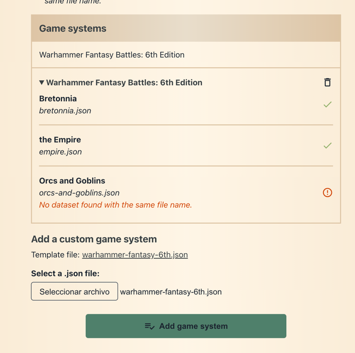
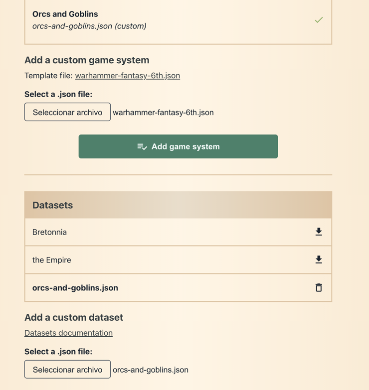
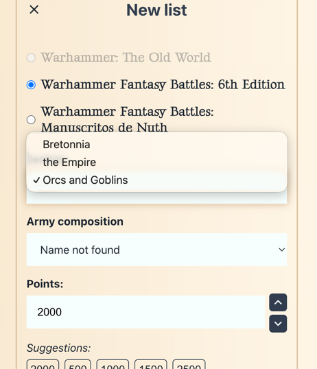

# How to Contribute — Adding Army Lists

Thank you for your interest in contributing to the **Warhammer Fantasy 6th Edition Builder**! There are two main ways to add or improve army lists:

1. [Cloning the repository and editing the JSON files directly](#option-1-cloning-the-repository)
2. [Using the Custom Datasets feature and sending the JSON by mail](#option-2-using-custom-datasets)

---

## Option 1: Cloning the Repository

This is the recommended approach if you are comfortable with Git and basic web development.

### Prerequisites

- [Node.js](https://nodejs.org/) (v16 or later recommended)
- [Yarn](https://yarnpkg.com/) (v1 or v3+)
- A [GitHub](https://github.com/) account
- A code editor (e.g. [VS Code](https://code.visualstudio.com/))

### Steps

1. **Fork the repository** on GitHub:
   [https://github.com/paradell/whfb6th-builder](https://github.com/paradell/whfb6th-builder)

2. **Clone your fork** locally:
   ```bash
   git clone https://github.com/<your-username>/whfb6th-builder.git
   cd whfb6th-builder
   ```

3. **Install dependencies:**
   ```bash
   yarn install
   ```

4. **Start the development server:**
   ```bash
   yarn start
   ```
   The app will open at [http://localhost:3000](http://localhost:3000).

5. **Edit or create the army JSON files.**

   Army datasets are located in:
   ```
   public/games/warhammer-fantasy-6th/
   ```
   The main game system index file is:
   ```
   src/assets/warhammer-fantasy-6th.json
   ```

   - To **add a new army**, create a new file `public/games/warhammer-fantasy-6th/<new_army_id>.json` following the [dataset format](datasets.md).
   - Register the new army in `src/assets/warhammer-fantasy-6th.json` by adding an entry to the armies array with the correct `id`, `name_en`, `name_es`, `armyComposition`, `allies`, and `mercenaries` fields.
   - To **edit an existing army**, find its file in `public/games/warhammer-fantasy-6th/` and modify it.

   > 💡 Use the [dataset format documentation](datasets.md) as a reference for the JSON structure.

6. **Test your changes** in the browser at [http://localhost:3000](http://localhost:3000):
   - Create a new list for the army you added or modified.
   - Check that all units, options, magic items, and army composition rules work correctly.
   - Validate that army composition limits and special rules behave as expected.

7. **Commit and push** your changes to your fork:
   ```bash
   git add .
   git commit -m "feat: add <army name> dataset"
   git push origin main
   ```

8. **Open a Pull Request** from your fork to the main repository on GitHub, describing what you added or changed.

---

## Option 2: Using Custom Datasets

This option requires no development setup. You only need a text editor and a web browser.

### Steps

1. **Download the base game system file** from the [Custom datasets](https://paradell.github.io/whfb6th-builder/custom-datasets) page.
   - Download the `warhammer-fantasy-6th.json` file.

2. **Edit `warhammer-fantasy-6th.json`** to register your new army:

   ```json
   {
     "id": "new_army_id",
     "name_en": "New Army Name",
     "name_es": "Nombre del nuevo ejército",
     "items": ["general"],
     "armyComposition": [
       "new_army_id"
     ],
     "allies": [],
     "mercenaries": {}
   }
   ```

3. **Create the army dataset file** `new_army_id.json` following the [dataset format](datasets.md).

4. **Test it locally** by uploading the files on the [Custom datasets](https://paradell.github.io/whfb6th-builder/custom-datasets) page:
   1. Upload your edited `warhammer-fantasy-6th.json`. The new army will appear in the list, but will be empty.
   
   2. Upload your new army dataset file (`new_army_id.json`).
   
   3. Create a new list and verify the new army is available and works correctly.
   

5. **Send the files by email** once you are happy with the result:
   - Send both `warhammer-fantasy-6th.json` (updated) and `new_army_id.json` to the project maintainer.
   - Include a short description of the army and any relevant notes.

   > 📬 You can find the maintainer's contact in the [README](../README.md) or on the GitHub repository page.

---

## Tips

- Unit IDs should be based on their English name as it appears on [6th.whfb.app](https://6th.whfb.app/) (e.g. `"bretonnian-lord"`).
- Always include `name_en`. `name_es` is optional but appreciated.
- Use existing armies (e.g. `bretonnia.json`) as reference for the JSON structure.
- Make sure the `armyComposition` IDs in the unit entries match those defined in the game system file.
- If an army has no mercenaries or allies, leave those as empty arrays `[]`.

---

# Cómo Contribuir — Añadir Listas de Ejércitos

¡Gracias por tu interés en contribuir al **Constructor de Warhammer Fantasy 6ª Edición**! Hay dos maneras principales de añadir o mejorar listas de ejércitos:

1. [Clonando el repositorio y editando los ficheros JSON directamente](#opción-1-clonar-el-repositorio)
2. [Usando la función de Datasets personalizados y enviando el JSON por correo](#opción-2-usar-datasets-personalizados)

---

## Opción 1: Clonar el Repositorio

Este es el método recomendado si te sientes cómodo con Git y el desarrollo web básico.

### Requisitos previos

- [Node.js](https://nodejs.org/) (v16 o superior recomendado)
- [Yarn](https://yarnpkg.com/) (v1 o v3+)
- Una cuenta en [GitHub](https://github.com/)
- Un editor de código (p. ej. [VS Code](https://code.visualstudio.com/))

### Pasos

1. **Haz un fork del repositorio** en GitHub:
   [https://github.com/paradell/whfb6th-builder](https://github.com/paradell/whfb6th-builder)

2. **Clona tu fork** en local:
   ```bash
   git clone https://github.com/<tu-usuario>/whfb6th-builder.git
   cd whfb6th-builder
   ```

3. **Instala las dependencias:**
   ```bash
   yarn install
   ```

4. **Inicia el servidor de desarrollo:**
   ```bash
   yarn start
   ```
   La aplicación se abrirá en [http://localhost:3000](http://localhost:3000).

5. **Edita o crea los ficheros JSON del ejército.**

   Los datasets de los ejércitos se encuentran en:
   ```
   public/games/warhammer-fantasy-6th/
   ```
   El fichero índice del sistema de juego es:
   ```
   src/assets/warhammer-fantasy-6th.json
   ```

   - Para **añadir un nuevo ejército**, crea un fichero `public/games/warhammer-fantasy-6th/<id_nuevo_ejercito>.json` siguiendo el [formato de dataset](datasets.md).
   - Registra el nuevo ejército en `src/assets/warhammer-fantasy-6th.json` añadiendo una entrada al array de ejércitos con los campos `id`, `name_en`, `name_es`, `armyComposition`, `allies` y `mercenaries`.
   - Para **editar un ejército existente**, busca su fichero en `public/games/warhammer-fantasy-6th/` y modifícalo.

   > 💡 Usa la [documentación del formato de dataset](datasets.md) como referencia para la estructura JSON.

6. **Prueba los cambios** en el navegador en [http://localhost:3000](http://localhost:3000):
   - Crea una nueva lista para el ejército que hayas añadido o modificado.
   - Comprueba que todas las unidades, opciones, objetos mágicos y reglas de composición de ejército funcionan correctamente.
   - Verifica que los límites de composición y las reglas especiales se comportan como se espera.

7. **Haz commit y push** de tus cambios a tu fork:
   ```bash
   git add .
   git commit -m "feat: añadir dataset <nombre del ejército>"
   git push origin main
   ```

8. **Abre un Pull Request** desde tu fork al repositorio principal en GitHub, describiendo qué has añadido o cambiado.

---

## Opción 2: Usar Datasets Personalizados

Esta opción no requiere ninguna configuración de desarrollo. Solo necesitas un editor de texto y un navegador.

### Pasos

1. **Descarga el fichero base del sistema de juego** desde la página de [Custom datasets](https://paradell.github.io/whfb6th-builder/custom-datasets).
   - Descarga el fichero `warhammer-fantasy-6th.json`.

2. **Edita `warhammer-fantasy-6th.json`** para registrar tu nuevo ejército:

   ```json
   {
     "id": "id_nuevo_ejercito",
     "name_en": "New Army Name",
     "name_es": "Nombre del nuevo ejército",
     "items": ["general"],
     "armyComposition": [
       "id_nuevo_ejercito"
     ],
     "allies": [],
     "mercenaries": {}
   }
   ```

3. **Crea el fichero del dataset del ejército** `id_nuevo_ejercito.json` siguiendo el [formato de dataset](datasets.md).

4. **Pruébalo** subiendo los ficheros en la página de [Custom datasets](https://paradell.github.io/whfb6th-builder/custom-datasets):
   1. Sube tu `warhammer-fantasy-6th.json` editado. El nuevo ejército aparecerá en la lista, pero estará vacío.
   
   2. Sube el fichero del dataset del nuevo ejército (`id_nuevo_ejercito.json`).
   
   3. Crea una nueva lista y verifica que el nuevo ejército está disponible y funciona correctamente.
   

5. **Envía los ficheros por correo electrónico** cuando estés satisfecho con el resultado:
   - Envía tanto `warhammer-fantasy-6th.json` (actualizado) como `id_nuevo_ejercito.json` al mantenedor del proyecto.
   - Incluye una breve descripción del ejército y cualquier nota relevante.

   > 📬 Puedes encontrar el contacto del mantenedor en el [README](../README.md) o en la página del repositorio de GitHub.

---

## Consejos

- Los IDs de las unidades deben basarse en su nombre en inglés tal como aparece en [6th.whfb.app](https://6th.whfb.app/) (p. ej. `"bretonnian-lord"`).
- Incluye siempre `name_en`. `name_es` es opcional, pero se agradece.
- Usa ejércitos existentes (p. ej. `bretonnia.json`) como referencia para la estructura JSON.
- Asegúrate de que los IDs de `armyComposition` en las entradas de unidades coinciden con los definidos en el fichero del sistema de juego.
- Si un ejército no tiene mercenarios ni aliados, déjalos como arrays vacíos `[]`.

